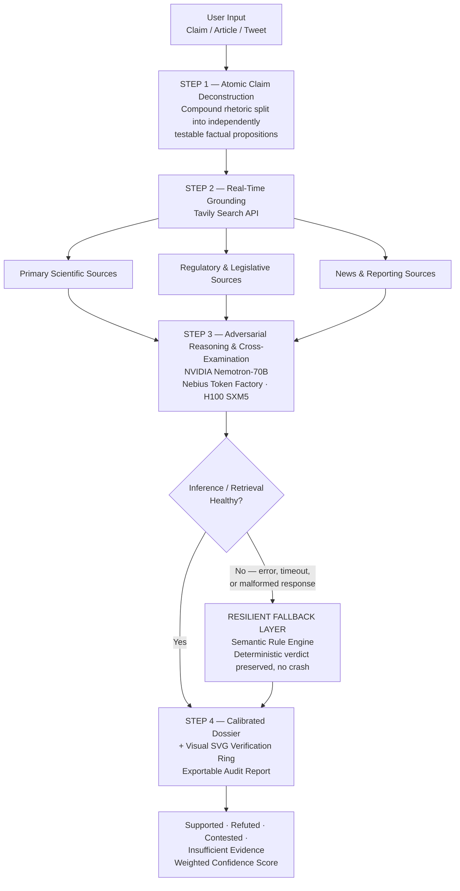

# VeritasAI — Autonomous Evidence-Based Verification & Truth Intelligence

[](https://nextjs.org/)
[](https://build.nvidia.com/)
[](https://nebius.com/)
[](https://tavily.com/)
[](https://tailwindcss.com/)
[](https://www.typescriptlang.org/)

> **"Separate signal from noise. VeritasAI is an autonomous fact-checking and truth-synthesis research console. It decomposes complex viral claims, grounds assertions with real-time web retrieval via Tavily, and generates calibrated confidence dossiers using NVIDIA Nemotron on Nebius Token Factory."**

---

## 1. Live Demo & Preview

| Resource                 | Link                                                                                                                  |
| :----------------------- | :-------------------------------------------------------------------------------------------------------------------- |
| 🚀 **Live Deployment**   | [https://veritas-io.netlify.app/](https://veritas-io.netlify.app/)                                                    |
| 📦 **Public Repository** | Public GitHub repository — source, issues and architecture notes are openly available for review and jury inspection. |

> The hosted build is production-deployed on Netlify and runs the full four-stage agentic pipeline end-to-end. No local setup is required to evaluate the system.

---

## 2. The Problem — Information Disorder & Hallucination

Modern information ecosystems are structurally hostile to truth verification:

1. **68% of viral claims blend verifiable fact with deliberate manipulation.** The most dangerous misinformation is not fully fabricated — it is a credible core wrapped in distorted framing, selectively quoted statistics, and decontextualized expert voices. Detecting _what is true_ is insufficient; a system must isolate _which parts_ are true.
2. **Traditional fact-checking operates on a latency of days.** Human editorial verification cycles cannot compete with the propagation speed of a claim across social platforms, where a narrative can reach millions before any correction is published. By the time a verdict lands, the epistemic damage is done.
3. **LLM outputs are ungrounded without empirical backing.** A language model's parametric memory is frozen at training time and statistically prone to confident fabrication. Any deployment in a verification context must ground every assertion in retrieved, timestamped, externally verifiable evidence — not model recall.

### The VeritasAI Solution

VeritasAI replaces the slow, linear fact-check with an **autonomous agentic pipeline** that deconstructs a claim into atomic assertions, retrieves live evidence for each one through Tavily, subjects every assertion to independent cross-verification by **NVIDIA Nemotron-70B** hosted on **Nebius Token Factory**, and emits a **calibrated confidence dossier** exposing support, contradiction, uncertainty, and unresolved gaps — in seconds rather than days.

---

## 3. Key Architectural Innovations

### 3.1 End-to-End Architectural Flow



### 3.2 Autonomous 4-Stage Agentic Pipeline

| Stage  | Name                                   | Function                                                                                                                                                                                                                                                                            |
| :----: | :------------------------------------- | :---------------------------------------------------------------------------------------------------------------------------------------------------------------------------------------------------------------------------------------------------------------------------------- |
| **01** | **Deconstruction**                     | The input claim (any length, any format) is parsed into atomic, independently testable assertions. Compound rhetoric is split into discrete factual propositions, each with its own verification obligation.                                                                        |
| **02** | **Tavily Real-Time Grounding**         | Each atomic assertion triggers a live Tavily Search API retrieval, pulling current, source-attributable evidence from the open web — primary scientific literature, regulatory text, and news reporting. No model memory is trusted — grounding is always external and timestamped. |
| **03** | **NVIDIA Nemotron Cross-Verification** | Retrieved evidence is passed to **nvidia/Llama-3.1-Nemotron-70B-Instruct-HF** on Nebius Token Factory, which performs adversarial cross-examination: does the evidence support, contradict, qualify, or fail to address the assertion?                                              |
| **04** | **Calibration & Dossier**              | Per-assertion verdicts are aggregated into a weighted confidence score, with explicit separation of _supported_, _refuted_, _contested_, and _insufficient evidence_, delivered as a structured, auditable dossier with a visual SVG verification ring.                             |

### 3.3 Tailored Hackathon Jury Quick-Inspection Prompts

To accelerate technical evaluation, VeritasAI ships with four pre-loaded inspection scenarios, each designed to stress a distinct capability of the stack:

- **🧬 Medicine — Vitamin C vs. PubMed:** A health claim is decomposed and grounded against peer-reviewed clinical literature, testing the system's ability to distinguish in-vitro findings from human-trial evidence.
- **🧠 NVIDIA Nemotron RLHF / RLAIF:** A claim concerning reinforcement learning from human and AI feedback is verified against technical literature, exercising Nemotron's domain fluency in alignment research.
- **🏭 AI Data Centers & SMR Reactors:** A claim linking AI compute expansion to small modular reactor deployment is verified against energy and infrastructure reporting — a high-noise, fast-moving news domain.
- **⚖️ EU AI Act Compliance:** A regulatory claim is tested against primary legislative text, verifying the system's capacity to ground assertions in legal sources rather than secondary summaries.

### 3.4 Native Bilingual Architecture

VeritasAI is **bilingual by design, not by translation layer**. Both the UI surface and the inference reasoning path are fully dual-language (**English / Polish**), meaning the deconstruction, retrieval query construction, Nemotron cross-verification, and the final dossier are natively executed and rendered in the selected language — preserving nuance, legal terminology, and domain register in either locale.

### 3.5 Enterprise-Grade Resilience

Inference endpoints and external retrieval APIs can degrade under load. VeritasAI embeds a **Semantic Rule Engine** as a deterministic fallback layer: when the primary Nemotron inference or Tavily retrieval path returns an error, timeout, or malformed response, the engine preserves pipeline integrity and returns a degraded-but-honest verdict rather than crashing the session. **The console does not fail closed into white screens.**

---

## 4. Tech Stack & Infrastructure

| Layer         | Technology                                  |
| :------------ | :------------------------------------------ |
| **Frontend**  | Next.js 16                                  |
| **Styling**   | Tailwind CSS                                |
| **Icons**     | Lucide React                                |
| **Inference** | Nebius Token Factory (H100)                 |
| **Model**     | `nvidia/Llama-3.1-Nemotron-70B-Instruct-HF` |
| **Grounding** | Tavily Search API                           |
| **Language**  | TypeScript                                  |

---

## 5. Getting Started & Local Setup

### Step 1 — Clone the repository

```bash
git clone https://github.com/your-username/veritas-ai.git
cd veritas-ai
```

### Step 2 — Install dependencies

```bash
pnpm install
```

### Step 3 — Configure environment variables

Create a `.env.local` file in the project root:

```bash
TAVILY_API_KEY=your_tavily_api_key_here
NEBIUS_API_KEY=your_nebius_api_key_here
```

| Variable         | Purpose                                                                                     | Where to Obtain                              | Notes                                                                                                                       |
| :--------------- | :------------------------------------------------------------------------------------------ | :------------------------------------------- | :-------------------------------------------------------------------------------------------------------------------------- |
| `TAVILY_API_KEY` | Real-time web grounding and source retrieval for every atomic assertion.                    | [app.tavily.com](https://app.tavily.com)     | Tavily provides a free monthly query allowance, sufficient to evaluate the full pipeline.                                   |
| `NEBIUS_API_KEY` | High-throughput inference for **NVIDIA Nemotron-70B** via Nebius Token Factory (H100 SXM5). | [studio.nebius.ai](https://studio.nebius.ai) | VeritasAI includes a deterministic **Semantic Fallback Engine**, so the app remains fully navigable even if keys are unset. |

### Step 4 — Run the development server

```bash
pnpm dev
```

Then open **[http://localhost:3000](http://localhost:3000)** in your browser and submit a claim to launch the pipeline.

---

## 6. Hackathon Alignment & Evaluation Tracks

| Track                    | Category                    | Technical Implementation                                                                                                               |
| :----------------------- | :-------------------------- | :------------------------------------------------------------------------------------------------------------------------------------- |
| **Primary Track**        | **NVIDIA Nemotron**         | Core inference, logical deconstruction, and truth synthesis reasoning executed by `nvidia/Llama-3.1-Nemotron-70B-Instruct-HF`.         |
| **Infrastructure Track** | **Nebius Token Factory**    | Production model serving orchestrated via Nebius Token Factory on high-throughput H100 SXM5 GPU clusters.                              |
| **Partner Track**        | **Tavily Search Grounding** | Real-time web retrieval pipeline extracting verified citations, eliminating parametric hallucinations, and computing source authority. |

---

## 7. Privacy & Compliance (EU AI Act Ready)

VeritasAI is built for deployment in a regulated European context:

- **Granular consent banner (GDPR / ePrivacy compliant):** consent is collected per category — strictly necessary, analytics, and functional — with no pre-ticked boxes and no dark patterns. Users may grant, reject, or granularly modify consent at any time.
- **Transparent, auditable logs:** every pipeline execution records the retrieved sources, the verification verdict per assertion, and the model reasoning path, producing an inspection trail suitable for regulatory audit and human review.
- **Immediate session purge:** session data and query history can be purged instantly and irreversibly on user request, with no residual storage in application state.

Designed in alignment with the **EU AI Act** transparency and human-oversight principles for AI systems producing consequential informational outputs.

---

## 8. Author & Acknowledgments

**Author:** **Adam Gierczak** — NVIDIA & Nebius Global AI Hackathon 2026

**Acknowledgments:**

- The **NVIDIA Developer** team, for the Nemotron model family and open model tooling.
- The **Nebius Token Factory** team, for high-throughput H100 inference infrastructure.
- The **Tavily AI** team, for real-time, agent-optimized web retrieval.

---

<div align="center">

**VeritasAI** — _Separate signal from noise._

</div>
