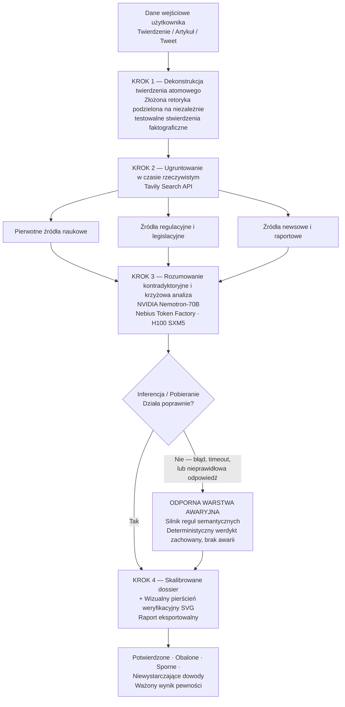

# VeritasAI — Autonomiczna Weryfikacja Oparta na Dowodach i Inteligencja Prawdy

[English](README.md) | Polski

[](https://nextjs.org/)
[](https://build.nvidia.com/)
[](https://nebius.com/)
[](https://tavily.com/)
[](https://tailwindcss.com/)
[](https://www.typescriptlang.org/)
[](https://youtu.be/DwpJtKu9bpA)

> **„Oddziel sygnał od szumu. VeritasAI to autonomiczna konsola badawcza do fact-checkingu i syntezy prawdy. Rozkłada złożone, wiralowe twierdzenia na części, ugruntowuje stwierdzenia poprzez pobieranie danych z sieci w czasie rzeczywistym za pomocą Tavily i generuje skalibrowane dossier wiarygodności przy użyciu NVIDIA Nemotron na Nebius Token Factory.”**

---

## 1. Demo na żywo i podgląd

| Zasób                         | Link                                                                                                                                                          |
| :---------------------------- | :------------------------------------------------------------------------------------------------------------------------------------------------------------ |
| 🚀 **Wdrożenie na żywo**      | [https://veritas-io.netlify.app/](https://veritas-io.netlify.app/)                                                                                            |
| 🎬 **Wideo demo**             | [https://youtu.be/DwpJtKu9bpA](https://youtu.be/DwpJtKu9bpA) _(1,5-minutowy walkthrough)_                                                                     |
| 📦 **Publiczne repozytorium** | [https://github.com/AdamBabinicz/veritas](https://github.com/AdamBabinicz/veritas) — kod źródłowy, notatki architektoniczne i skrypty weryfikacyjne dla jury. |

[](https://youtu.be/DwpJtKu9bpA)

> Hostowana wersja jest produkcyjnie wdrożona na Netlify i uruchamia pełny, czteroetapowy pipeline agentowy end-to-end. Do oceny systemu nie jest wymagana konfiguracja lokalna.

---

## 2. Problem — chaos informacyjny i halucynacje

Współczesne ekosystemy informacyjne są strukturalnie wrogie wobec weryfikacji prawdy:

1. **68% wiralowych twierdzeń łączy weryfikowalne fakty z celową manipulacją.** Najgroźniejsza dezinformacja nie jest w pełni zmyślona — to wiarygodny rdzeń opakowany w zniekształcone ramowanie, wybiórczo cytowane statystyki i wyrwane z kontekstu głosy ekspertów. Samo wykrycie _co jest prawdziwe_ nie wystarcza; system musi wyodrębnić _które części_ są prawdziwe.
2. **Tradycyjny fact-checking działa z opóźnieniem liczonym w dniach.** Cykl redakcyjnej weryfikacji prowadzonej przez ludzi nie jest w stanie konkurować z tempem rozprzestrzeniania się twierdzeń w mediach społecznościowych, gdzie narracja może dotrzeć do milionów osób, zanim zostanie opublikowane jakiekolwiek sprostowanie. Zanim zapadnie werdykt, szkoda epistemiczna jest już dokonana.
3. **Wyniki LLM-ów są nieugruntowane bez empirycznego zaplecza.** Pamięć parametryczna modelu językowego jest zamrożona w momencie treningu i statystycznie podatna na pewnie brzmiące konfabulacje. Każde wdrożenie w kontekście weryfikacji musi opierać każde twierdzenie na pozyskanych, oznaczonych czasowo i zewnętrznie weryfikowalnych dowodach — a nie na pamięci modelu.

### Rozwiązanie VeritasAI

VeritasAI zastępuje powolny, liniowy fact-check **autonomicznym pipeline’em agentowym**, który rozkłada twierdzenie na atomowe stwierdzenia, pobiera dla każdego z nich aktualne dowody za pośrednictwem Tavily, poddaje każde stwierdzenie niezależnej weryfikacji krzyżowej przez **NVIDIA Nemotron-70B** hostowany na **Nebius Token Factory**, a następnie generuje **skalibrowane dossier wiarygodności**, pokazujące potwierdzenie, sprzeczność, niepewność i nierozstrzygnięte luki — w ciągu sekund, a nie dni.

---

## 3. Kluczowe innowacje architektoniczne

### 3.1 Przepływ architektury end-to-end



### 3.2 Autonomiczny 4-etapowy pipeline agentowy

|  Etap  | Nazwa                                         | Funkcja                                                                                                                                                                                                                                                                                                                                             |
| :----: | :-------------------------------------------- | :-------------------------------------------------------------------------------------------------------------------------------------------------------------------------------------------------------------------------------------------------------------------------------------------------------------------------------------------------- |
| **01** | **Dekonstrukcja**                             | Twierdzenie wejściowe (dowolnej długości, w dowolnym formacie) jest parsowane na atomowe, niezależnie testowalne stwierdzenia. Złożona retoryka zostaje rozbita na dyskretne propozycje faktograficzne, z których każda ma własny obowiązek weryfikacyjny.                                                                                          |
| **02** | **Ugruntowanie Tavily w czasie rzeczywistym** | Każde atomowe stwierdzenie uruchamia pobranie danych przez Tavily Search API na żywo, które pozyskuje aktualne, przypisywalne do źródła dowody z otwartej sieci — z literatury naukowej, tekstów regulacyjnych i materiałów prasowych. Pamięć modelu nie jest uznawana za zaufane źródło — ugruntowanie jest zawsze zewnętrzne i oznaczone czasowo. |
| **03** | **Weryfikacja krzyżowa NVIDIA Nemotron**      | Pozyskane dowody są przekazywane do **nvidia/Llama-3.1-Nemotron-70B-Instruct-HF** na Nebius Token Factory, który wykonuje kontradyktoryjne badanie krzyżowe: czy dowody potwierdzają, przeczą, doprecyzowują czy nie odnoszą się do danego stwierdzenia?                                                                                            |
| **04** | **Kalibracja i dossier**                      | Werdykty dla poszczególnych stwierdzeń są agregowane do ważonego wyniku pewności, z wyraźnym rozdzieleniem na _potwierdzone_, _obalone_, _sporne_ i _niewystarczające dowody_, a następnie dostarczane jako uporządkowane, audytowalne dossier z wizualnym pierścieniem weryfikacyjnym SVG.                                                         |

### 3.3 Gotowe scenariusze szybkiej inspekcji dla jury hackathonu

Aby przyspieszyć ocenę techniczną, VeritasAI dostarcza cztery wstępnie załadowane scenariusze inspekcyjne, z których każdy został zaprojektowany tak, aby przetestować odrębną zdolność stosu technologicznego:

- **🧬 Medycyna — Witamina C vs. PubMed:** Twierdzenie zdrowotne jest dekomponowane i ugruntowywane względem recenzowanej literatury klinicznej, co testuje zdolność systemu do odróżniania wyników _in vitro_ od dowodów z badań na ludziach.
- **🧠 NVIDIA Nemotron RLHF / RLAIF:** Twierdzenie dotyczące uczenia ze wzmocnieniem z wykorzystaniem informacji zwrotnej od ludzi i AI jest weryfikowane względem literatury technicznej, sprawdzając biegłość Nemotrona w domenie badań nad alignmentem.
- **🏭 Centra danych AI i reaktory SMR:** Twierdzenie łączące rozwój mocy obliczeniowej AI z wdrażaniem małych reaktorów modułowych jest weryfikowane względem źródeł z obszaru energii i infrastruktury — czyli domeny o wysokim poziomie szumu i szybko zmieniających się wiadomościach.
- **⚖️ Zgodność z EU AI Act:** Twierdzenie regulacyjne jest testowane względem pierwotnego tekstu legislacyjnego, co weryfikuje zdolność systemu do opierania się na źródłach prawnych, a nie na wtórnych streszczeniach.

### 3.4 Natywnie dwujęzyczna architektura

VeritasAI jest **dwujęzyczny z założenia, a nie dzięki warstwie tłumaczeniowej**. Zarówno warstwa UI, jak i ścieżka rozumowania inferencyjnego są w pełni dwujęzyczne (**angielski / polski**), co oznacza, że dekonstrukcja, budowa zapytań do retrievalu, weryfikacja krzyżowa przez Nemotron oraz końcowe dossier są natywnie wykonywane i renderowane w wybranym języku — z zachowaniem niuansu, terminologii prawnej i rejestru domenowego w obu lokalizacjach.

### 3.5 Odporność klasy enterprise

Endpointy inferencyjne i zewnętrzne API retrievalowe mogą degradować się pod obciążeniem. VeritasAI zawiera **Silnik Reguł Semantycznych** jako deterministyczną warstwę awaryjną: gdy główna ścieżka inferencji Nemotrona lub retrievalu Tavily zwróci błąd, timeout albo nieprawidłową odpowiedź, silnik zachowuje integralność pipeline’u i zwraca zdegradowany, ale uczciwy werdykt zamiast doprowadzać do awarii sesji. **Konsola nie kończy pracy białym ekranem.**

---

## 4. Stos technologiczny i infrastruktura

| Warstwa          | Technologia                                 |
| :--------------- | :------------------------------------------ |
| **Frontend**     | Next.js 16                                  |
| **Stylowanie**   | Tailwind CSS                                |
| **Ikony**        | Lucide React                                |
| **Inferencja**   | Nebius Token Factory (H100)                 |
| **Model**        | `nvidia/Llama-3.1-Nemotron-70B-Instruct-HF` |
| **Ugruntowanie** | Tavily Search API                           |
| **Język**        | TypeScript                                  |

---

## 5. Pierwsze uruchomienie i konfiguracja lokalna

### Krok 1 — Sklonuj repozytorium

```bash
git clone https://github.com/AdamBabinicz/veritas.git
cd veritas
```

### Krok 2 — Zainstaluj zależności

```bash
pnpm install
```

### Krok 3 — Skonfiguruj zmienne środowiskowe

Utwórz plik `.env.local` w katalogu głównym projektu:

```bash
TAVILY_API_KEY=your_tavily_api_key_here
NEBIUS_API_KEY=your_nebius_api_key_here
```

| Zmienna          | Cel                                                                                                       | Gdzie uzyskać                                | Uwagi                                                                                                                                            |
| :--------------- | :-------------------------------------------------------------------------------------------------------- | :------------------------------------------- | :----------------------------------------------------------------------------------------------------------------------------------------------- |
| `TAVILY_API_KEY` | Ugruntowanie danych z sieci w czasie rzeczywistym i pobieranie źródeł dla każdego atomowego stwierdzenia. | [app.tavily.com](https://app.tavily.com)     | Tavily zapewnia darmowy miesięczny limit zapytań, wystarczający do oceny pełnego pipeline’u.                                                     |
| `NEBIUS_API_KEY` | Wysokoprzepustowa inferencja dla **NVIDIA Nemotron-70B** przez Nebius Token Factory (H100 SXM5).          | [studio.nebius.ai](https://studio.nebius.ai) | VeritasAI zawiera deterministyczny **Semantic Fallback Engine**, dzięki czemu aplikacja pozostaje w pełni używalna nawet bez ustawionych kluczy. |

### Krok 4 — Uruchom serwer deweloperski

```bash
pnpm dev
```

Następnie otwórz **[http://localhost:3000](http://localhost:3000)** w przeglądarce i wyślij twierdzenie, aby uruchomić pipeline.

---

## 6. Dopasowanie do hackathonu i ścieżki oceny

| Ścieżka                       | Kategoria                   | Implementacja techniczna                                                                                                                                             |
| :---------------------------- | :-------------------------- | :------------------------------------------------------------------------------------------------------------------------------------------------------------------- |
| **Główna ścieżka**            | **NVIDIA Nemotron**         | Główna inferencja, logiczna dekonstrukcja i rozumowanie syntezy prawdy wykonywane przez `nvidia/Llama-3.1-Nemotron-70B-Instruct-HF`.                                 |
| **Ścieżka infrastrukturalna** | **Nebius Token Factory**    | Produkcyjne serwowanie modelu orkiestrowane przez Nebius Token Factory na wysokoprzepustowych klastrach GPU H100 SXM5.                                               |
| **Ścieżka partnerska**        | **Tavily Search Grounding** | Pipeline pobierania danych z sieci w czasie rzeczywistym, wyciągający zweryfikowane cytowania, eliminujący parametryczne halucynacje i obliczający autorytet źródła. |

---

## 7. Prywatność i zgodność (gotowe na EU AI Act)

VeritasAI został zbudowany z myślą o wdrożeniu w regulowanym kontekście europejskim:

- **Szczegółowy baner zgody (zgodny z GDPR / ePrivacy):** zgoda jest zbierana per kategoria — niezbędne, analityczne i funkcjonalne — bez domyślnie zaznaczonych pól i bez dark patterns. Użytkownicy mogą w dowolnym momencie wyrazić zgodę, odrzucić ją lub zmodyfikować ustawienia szczegółowe.
- **Przejrzyste, audytowalne logi:** każde wykonanie pipeline’u zapisuje pobrane źródła, werdykt weryfikacyjny dla każdego stwierdzenia oraz ścieżkę rozumowania modelu, tworząc ślad inspekcyjny odpowiedni do audytu regulacyjnego i przeglądu przez człowieka.
- **Natychmiastowe czyszczenie sesji:** dane sesyjne i historia zapytań mogą zostać natychmiastowo i nieodwracalnie usunięte na żądanie użytkownika, bez pozostawiania resztek w stanie aplikacji.

Projekt opracowano zgodnie z zasadami przejrzystości i nadzoru człowieka określonymi w **EU AI Act** dla systemów AI wytwarzających istotne informacyjnie wyniki.

---

## 8. Autor i podziękowania

**Autor:** **Adam Gierczak** — NVIDIA & Nebius Global AI Hackathon 2026

**Podziękowania:**

- Zespołowi **NVIDIA Developer** za rodzinę modeli Nemotron i otwarte narzędzia modelowe.
- Zespołowi **Nebius Token Factory** za wysokoprzepustową infrastrukturę inferencyjną H100.
- Zespołowi **Tavily AI** za retrieval webowy w czasie rzeczywistym zoptymalizowany pod agentów.

---

<div align="center">

**VeritasAI** — _Oddziel sygnał od szumu._

</div>
